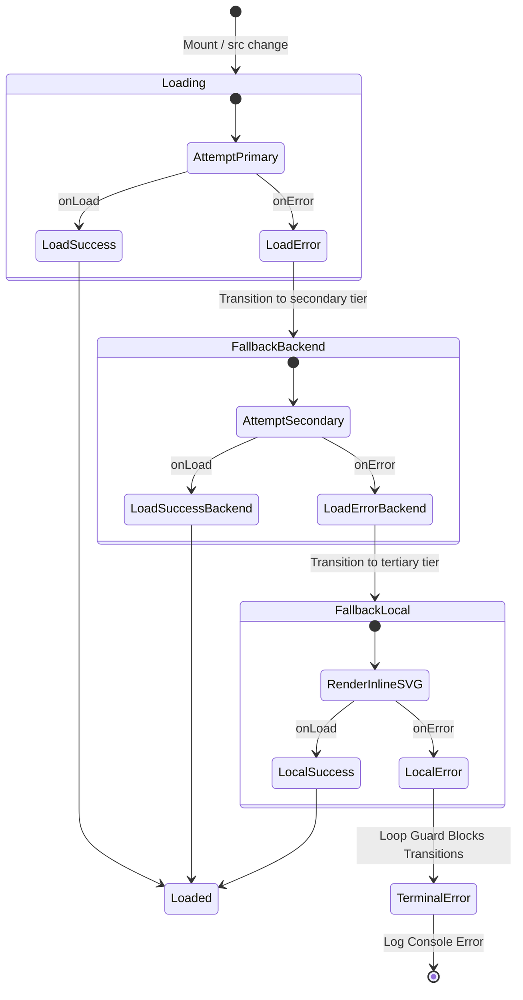

# Design: Remote Image Validation

## Technical Approach

To implement a unified, fault-tolerant remote image rendering mechanism, the existing [OptimizedImage.jsx](file:///C:/Users/agusm/Videos/prueba/LinkStash/frontend/src/components/OptimizedImage.jsx) component will be refactored. Rather than just offering image optimization (Cloudinary transformations), it will manage the loading lifecycle of all remote, local, and user-uploaded images. 

### 1. Extended State Transitions
The component will maintain a local state tracking the current lifecycle phase:
- `'loading'`: The initial state when a source is mounted. The component renders a Tailwind-based animated skeleton loader conforming to the image's dimensions.
- `'loaded'`: The success state. The skeleton is hidden and the resolved image is displayed.
- `'fallback-backend'`: The secondary load attempt. If the primary image URL fails, the component attempts to fetch `/defaults/default-image.png` relative to the backend API host.
- `'fallback-local'`: The tertiary load attempt. If the backend is down or the asset is missing, the component loads a bundled, inline base64-encoded SVG placeholder.

### 2. Skeleton Sizing & CSS
To prevent Cumulative Layout Shift (CLS), the skeleton loader must occupy the same layout space as the final image. 
- Sizing properties (`width` and `height`) and wrapper styles will define container constraints.
- While `'loading'` is active, a layout-matching `div` with class `animate-pulse bg-gray-200 dark:bg-gray-700` is rendered, while the underlying `` element is kept in the DOM hidden (`style={{ display: 'none' }}`) to allow the browser to attempt background resolution and trigger lifecycle callbacks.

### 3. Local Base64 Fallback
The tertiary fallback will utilize an inline SVG string, avoiding external HTTP requests.
```javascript
const LOCAL_FALLBACK_SVG = 'data:image/svg+xml;base64,PHN2ZyB4bWxucz0iaHR0cDovL3d3dy53My5vcmcvMjAwMC9zdmciIHdpZHRoPSI4MCIgaGVpZ2h0PSI4MCIgdmlld0JveD0iMCAwIDgwIDgwIj4KICA8cmVjdCB3aWR0aD0iODAiIGhlaWdodD0iODAiIGZpbGw9IiNGM0Y0RjYiIHJ4PSI4Ii8+CiAgPHBhdGggZD0iTTM1IDQ4TDMwIDQzTDIyIDUxaDM2TDUwIDQwTDM1IDQ4eiIgZmlsbD0iI0QxRDVREIi8+CiAgPGNpcmNsZSBjeD0iMzAiIGN5PSIzMCIgcj0iNCIgZmlsbD0iI0QxRDVREIi8+Cjwvc3ZnPg==';
```

---

## Architecture Decisions

### Decision: Component Consolidation vs Wrapper Component
**Choice**: Approach 2 (Extend existing [OptimizedImage.jsx](file:///C:/Users/agusm/Videos/prueba/LinkStash/frontend/src/components/OptimizedImage.jsx)).
**Alternatives considered**: 
- *Approach 1*: Build a separate `SafeImage` wrapper.
- *Approach 3*: Build a composite layout wrapper.
**Rationale**: By refactoring `OptimizedImage`, all existing frontend elements already using it (e.g. `LinkCard`, `DescriptionModal`, `EditLinkModal`) automatically inherit the multi-tier error validation and loop prevention. This avoids redundant wrappers and nested React renders.

### Decision: Embedding SVG Fallback Inline vs Separate Asset
**Choice**: Inline Base64 SVG string.
**Alternatives considered**: 
- Referencing a static SVG file in the frontend `/public` directory.
**Rationale**: Assets in the frontend `/public` directory depend on the static file server and client network. If the client is completely offline, or the frontend server configuration fails, the fallback asset itself will 404. Storing the fallback inline as a base64 string guarantees it will render under any conditions.

### Decision: State Transition and Loop Prevention
**Choice**: Strict state machine transitioning from `loading` -> `fallback-backend` -> `fallback-local` -> final loop-blocked state.
**Alternatives considered**:
- Numeric error retries (e.g., retrying up to 3 times).
**Rationale**: A simple error counter does not distinguish between different sources. Under network instability, a count-based system might request the broken primary image multiple times, or loop infinitely if the fallback source also throws error events. Explicit state phases ensure a one-way path ending at the local fallback.

---

## Data Flow

The following state machine details how `OptimizedImage` handles errors and fallbacks:



---

## File Changes

| File Path | Action | Description / Rationale |
| --- | --- | --- |
| [frontend/src/components/OptimizedImage.jsx](file:///C:/Users/agusm/Videos/prueba/LinkStash/frontend/src/components/OptimizedImage.jsx) | Modify | Implement state transitions, skeleton loading wrapper UI, backend fallback retrieval, and inline base64 SVG fallback with infinite loop protection. |
| [frontend/src/components/LinkForm.jsx](file:///C:/Users/agusm/Videos/prueba/LinkStash/frontend/src/components/LinkForm.jsx) | Modify | Replace the raw `` preview tag for URL favicons with `OptimizedImage`. Remove inline `onError` styles. |
| [frontend/src/pages/myLinks.jsx](file:///C:/Users/agusm/Videos/prueba/LinkStash/frontend/src/pages/myLinks.jsx) | Modify | Replace raw `` previews in detail panel and form edit preview with `OptimizedImage` elements. |
| [frontend/src/components/LinkCard.jsx](file:///C:/Users/agusm/Videos/prueba/LinkStash/frontend/src/components/LinkCard.jsx) | Modify | Replace raw thumbnail fallbacks and custom component `imageError` state with consolidated `OptimizedImage` usage. |
| [frontend/src/components/DescriptionModal.jsx](file:///C:/Users/agusm/Videos/prueba/LinkStash/frontend/src/components/DescriptionModal.jsx) | Modify | Remove manual `onError` inline layout adjustments and rely on `OptimizedImage` fallbacks. |
| [frontend/src/components/EditLinkModal.jsx](file:///C:/Users/agusm/Videos/prueba/LinkStash/frontend/src/components/EditLinkModal.jsx) | Modify | Remove manual `onError` inline layout adjustments and rely on `OptimizedImage` fallbacks. |
| [frontend/tests/unit/OptimizedImage.test.jsx](file:///C:/Users/agusm/Videos/prueba/LinkStash/frontend/tests/unit/OptimizedImage.test.jsx) | Create | Add unit tests to verify initial loading, successful resolution, transition to backend fallback, transition to local fallback, and loop guard block. |

---

## Interfaces / Contracts

### `OptimizedImage` Prop Types

| Prop | Type | Required | Default | Description |
| --- | --- | --- | --- | --- |
| `src` | `String` | Yes | - | Target URL of the image. If null/empty, fallback triggers immediately. |
| `alt` | `String` | No | `''` | Accessible label for the image. |
| `width` | `Number\|String` | No | `400` | Target rendering width. |
| `height` | `Number\|String` | No | `300` | Target rendering height. |
| `className` | `String` | No | `'w-full h-full object-cover'` | Style classes passed to the skeleton wrapper and the image. |
| `quality` | `Number` | No | `80` | Image compression quality (for Cloudinary targets). |
| `isStored` | `Boolean` | No | `false` | Instructs optimizer if image is stored in backend storage. |
| `isCloudinary` | `Boolean` | No | `false` | Instructs optimizer if image is hosted on Cloudinary. |
| `onLoad` | `Function` | No | - | Callback triggered on successful render. |
| `onError` | `Function` | No | - | Callback triggered on fallback sequence step or failure. |
| `eager` | `Boolean` | No | `false` | Forces browser eager loading over default lazy behavior. |

---

## Testing Strategy

### Unit Tests ([OptimizedImage.test.jsx](file:///C:/Users/agusm/Videos/prueba/LinkStash/frontend/tests/unit/OptimizedImage.test.jsx))
Using Vitest and `@testing-library/react`, we will test the following scenarios:
1. **Initial loading state**: Renders a skeleton loader containing matching dimensions.
2. **Successful Primary Load**: Simulating `onLoad` on the primary image removes the skeleton and shows the image.
3. **Primary Error Fallback**: Simulating `onError` on the primary source transitions state to `fallback-backend` and updates `img.src` to point to `/defaults/default-image.png`.
4. **Backend Fallback Error**: Simulating `onError` on the secondary source transitions state to `fallback-local` and updates `img.src` to the inline base64 SVG.
5. **Terminal Error Guard**: Simulating `onError` on the inline base64 SVG does not trigger further transitions, prevents retry loops, and calls `console.error` with a terminal message.

### Visual Validation
Manual validation to confirm that:
- Image layout wrappers do not shift when transitioning from loading skeleton to the loaded image.
- Form previews adapt sizing when local SVG loads.

---

## Threat Matrix

N/A (This is a client-side layout robustness enhancement).

---

## Migration / Rollout

1. Implement the changes in `OptimizedImage.jsx` and add the test file `OptimizedImage.test.jsx`.
2. Run Vitest `npm run test` to verify the state transitions and loop guard behavior.
3. Systematically replace standard `` elements with the new `OptimizedImage` in:
   - `LinkForm.jsx`
   - `myLinks.jsx`
   - `LinkCard.jsx`
   - `DescriptionModal.jsx`
   - `EditLinkModal.jsx`
4. Confirm existing test suites (unit, integration, and E2E) continue to pass.

---

## Open Questions

- *Should we display a specific icon (e.g. broken image) overlay inside the inline SVG placeholder?*
  - **Answer**: A generic gray geometric placeholder (as defined in the base64 SVG) is cleaner and matches standard dark/light mode visual designs better.

