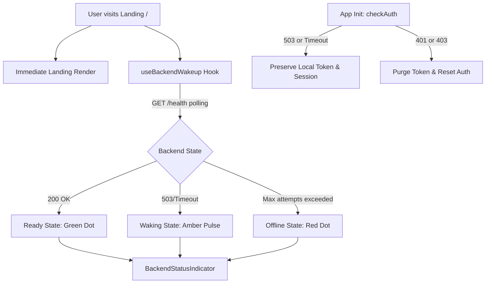
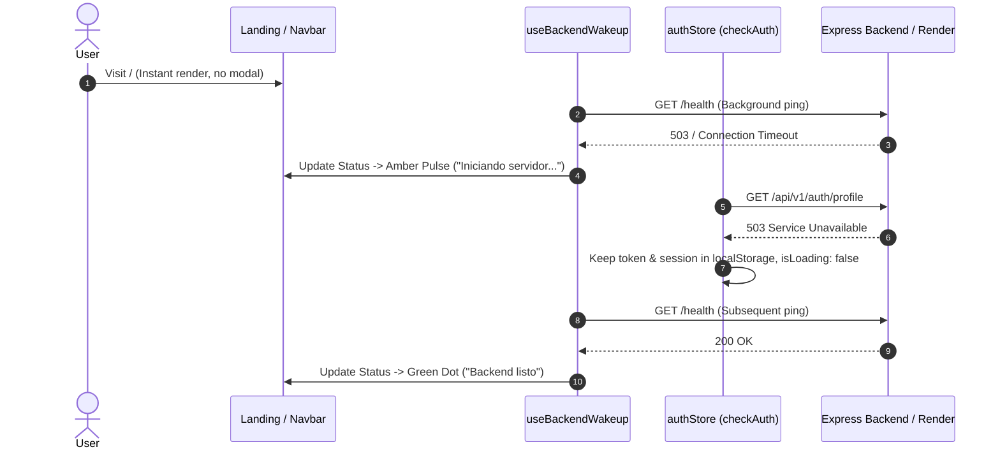

# Technical Design: Graceful Backend Degradation & Passive Wakeup UX

## 1. Context & Objectives
Render free-tier web services spin down after inactivity, causing 30–60s cold starts. The current UX blocks landing page interaction with a modal dialog (`ServerWakeupModal`), disables CTA navigation links, and risks clearing persisted auth tokens in [`authStore.js`](file:///C:/Users/agusm/Videos/DEV/LinkStash/frontend/src/stores/authStore.js) upon transient 503/timeout responses.

This design decouples health checks from UI rendering, adds non-intrusive status indicators, makes auth token validation cold-start resilient, and provides warm-up notices during login/register attempts.

---

## 2. Component & Architecture Decisions

### A. Non-Blocking Landing Viewport ([`Landing.jsx`](file:///C:/Users/agusm/Videos/DEV/LinkStash/frontend/src/pages/Landing.jsx))
- **Remove Blocking Elements**: Eliminate `ServerWakeupModal` and backdrop blur overlays.
- **Always-Active CTAs**: Remove `disabledClass` (`opacity-50`, `pointer-events-none`, `cursor-not-allowed`) and `aria-disabled` attributes from `LandingNavbar` and `HeroSection` buttons.
- **Header Integration**: Mount [`BackendStatusIndicator.jsx`](file:///C:/Users/agusm/Videos/DEV/LinkStash/frontend/src/components/BackendStatusIndicator.jsx) in `LandingNavbar`.

### B. Status Indicator Component ([`BackendStatusIndicator.jsx`](file:///C:/Users/agusm/Videos/DEV/LinkStash/frontend/src/components/BackendStatusIndicator.jsx))
- **Visual States**:
  - `Ready` (`isReady: true`): Subtle green indicator with tooltip `"Backend listo"`.
  - `Waking` (`isChecking: true, !isReady`): Amber pulsing dot (`animate-pulse`) with tooltip `"Iniciando servidor (Render free-tier). Puede demorar unos segundos."`.
  - `Offline` (`error, !isChecking`): Red indicator with tooltip `"Servidor no disponible"`.
- **Accessibility**: Includes `role="status"` and `aria-label` describing current operational state.

### C. Background Health Probing ([`useBackendWakeup.js`](file:///C:/Users/agusm/Videos/DEV/LinkStash/frontend/src/hooks/useBackendWakeup.js))
- Issues non-blocking `GET ${VITE_BACK_URL}/health` (timeout: 10s).
- Interval: 1.5s in development/test, 10s in production; bounded to 30 attempts.
- Returns reactive state `{ isReady, isChecking, error, attempts }`.

### D. Resilient Auth Store ([`authStore.js`](file:///C:/Users/agusm/Videos/DEV/LinkStash/frontend/src/stores/authStore.js))
- In `checkAuth()`, classify HTTP errors:
  - **401 Unauthorized / 403 Forbidden**: Explicit auth failure → call `authService.removeAuthToken()`, clear state `{ user: null, token: null, session: null, isAuthenticated: false, isLoading: false }`.
  - **Network Errors / Timeouts / 502 / 503 / 504**: Transient cold-start failure → retain existing `token`, `user`, `session`, `isAuthenticated`; only set `isLoading: false`.

### E. Contextual Auth Feedback ([`Login.jsx`](file:///C:/Users/agusm/Videos/DEV/LinkStash/frontend/src/pages/Login.jsx), [`Register.jsx`](file:///C:/Users/agusm/Videos/DEV/LinkStash/frontend/src/pages/Register.jsx))
- When authentication requests fail with 502/503/504 or network timeout, render an informative warm-up callout (`"El servidor se está iniciando (Render free-tier). Por favor espera unos momentos e intenta nuevamente."`).
- Preserve user form input values across retries.

---

## 3. Data Flow & Sequence

---

## 4. File Changes Matrix

| File Path | Action | Description |
|:---|:---|:---|
| [`frontend/src/pages/Landing.jsx`](file:///C:/Users/agusm/Videos/DEV/LinkStash/frontend/src/pages/Landing.jsx) | Modify | Remove `ServerWakeupModal`, remove CTA disable classes, integrate `BackendStatusIndicator`. |
| [`frontend/src/components/BackendStatusIndicator.jsx`](file:///C:/Users/agusm/Videos/DEV/LinkStash/frontend/src/components/BackendStatusIndicator.jsx) | Create | Status indicator dot/badge with tooltips and accessible aria roles. |
| [`frontend/src/hooks/useBackendWakeup.js`](file:///C:/Users/agusm/Videos/DEV/LinkStash/frontend/src/hooks/useBackendWakeup.js) | Modify | Ensure robust background polling without UI side-effects. |
| [`frontend/src/stores/authStore.js`](file:///C:/Users/agusm/Videos/DEV/LinkStash/frontend/src/stores/authStore.js) | Modify | Harden `checkAuth` error branch to preserve tokens on 5xx/network errors. |
| [`frontend/src/pages/Login.jsx`](file:///C:/Users/agusm/Videos/DEV/LinkStash/frontend/src/pages/Login.jsx) | Modify | Add cold-start warm-up banner for 5xx/network errors and retain inputs. |
| [`frontend/src/pages/Register.jsx`](file:///C:/Users/agusm/Videos/DEV/LinkStash/frontend/src/pages/Register.jsx) | Modify | Add cold-start warm-up banner for 5xx/network errors and retain inputs. |

---

## 5. Testing & Verification Strategy
1. **`useBackendWakeup` Tests**: Verify transitions (checking → ready, checking → error after 30 attempts, dev/test interval 1.5s).
2. **`BackendStatusIndicator` Tests**: Validate green, amber, red indicators, accessibility roles, and tooltip copy.
3. **`authStore.checkAuth` Tests**:
   - Mock 503 response: verify `token` and `isAuthenticated` persist in store and localStorage.
   - Mock 401 response: verify `token` and `isAuthenticated` are cleared.
4. **Landing & Auth Page Tests**:
   - Landing renders immediately without modal or disabled links.
   - Auth pages display warm-up callouts upon 503 responses without resetting input values.
